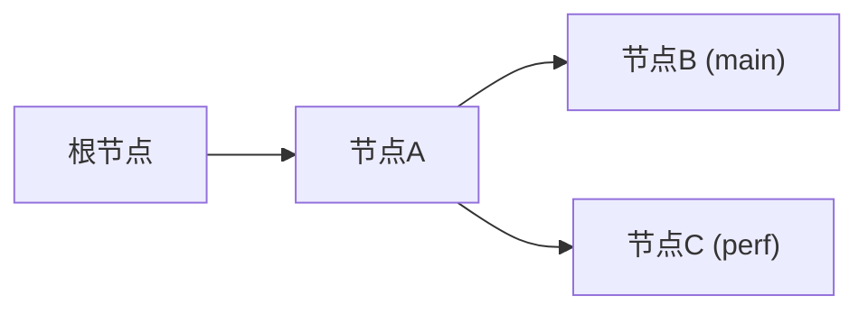
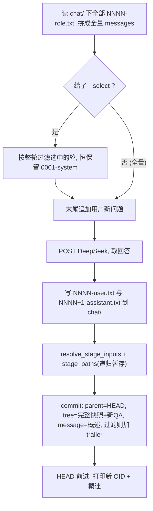

## giftai:基于 git 机制的 AI 对话上下文管理器

### 1. 核心思想

- **一轮对话(一问一答)= 一个 commit**;commit 的 `parent` = 选定的上文节点;沿 parent 链回溯即该轮的完整上下文。这正是 git commit DAG。
- **内容用 blob/tree 存**,采用**扁平快照式**:每个 commit 的 tree 平铺该会话到此为止的所有消息文件,靠内容寻址自动去重。
- **概述放进 commit message**(而非文件名),`giftai log` 直接显示每轮主题,文件名保持极简定长。
- **上下文选择 = 发送时过滤,不改结构**(关键决策):tree 永远是完整快照、parent 永远是当前节点(HEAD);「这次只用哪几轮」只是 `ask` 时对发送内容的过滤,不影响存储与血缘。因此 `git 祖先 = tree 内容`始终成立,无任何分歧。
  - 默认全量(把当前快照的所有轮都发);`--select` 给定后只发选中的轮。过滤按**整轮**进行(选中节点 = 它那一轮的 user+assistant 两个文件,且始终保留 `0001-system`),保证 messages 角色交替合法。
  - 过滤为 **ephemeral(只作用本轮)**;下一轮不带 `--select` 即回到全量。需要「持续聚焦某子集」时用 `checkout`/`branch`(结构性)表达。
  - 本轮若做了过滤,把选中的节点 OID 记进 commit trailer `Giftai-context: <oid...>`(复用 `CommitObject::trailing_headers`),以便复现「这条回答其实只基于子集生成」。
- **方案 B(解耦版)布局**:`.giftai` 放在**主文件夹(项目根)**,消息文件的工作区是根下的 `chat/`;二者为兄弟目录。这样 `giftai` 命令可在主文件夹(或任意子目录)直接运行,而对话内容仍隔离在 `chat/`,不污染代码。

### 2. 存储布局

```
project/                 # 主文件夹:在这里就能跑 giftai ask
  .git (或 .gift)        # 代码仓库,不受影响
  .giftai/               # 对话元数据(git_abs):objects/ refs/ HEAD …(由 init 生成)
  chat/                  # 对话工作区(worktree):仅放消息文件,与 .giftai 解耦
    0001-system.txt      # 当前节点 checkout 出来的消息文件
    0002-user.txt
    0003-assistant.txt
    ...
```

- 关键:`git_abs = <root>/.giftai`,`worktree = <root>/chat`,二者是独立绝对路径(现有库函数本就如此使用,不要求 git_abs 在 worktree 之内)。
- 命令运行位置:从主文件夹向上搜索 `.giftai` 即可定位,因此 `cd` 到 `chat/` 不再必要。
- 文件名格式 `NNNN-<role>.txt`,`role ∈ {system,user,assistant}`,4 位零填充序号保证 `BTreeMap` 字典序 = 时间序。
- 一轮新增两个文件:`NNNN-user.txt`(问题)、`NNNN+1-assistant.txt`(回答)。

### 3. 要实现的指令(giftai 子命令)

命令一览:

- `giftai init [root]` —— 初始化对话仓库(建 `.giftai` + `chat/` + 系统提示词)。
- `giftai ask [--select <oid|seq>,...] "问题"` —— 核心:发起一轮对话。
- `giftai context [--select ...]` —— 预览本次将实际发送的 messages,不调 API。
- `giftai log` —— 沿当前链查看历史(每轮主题取自 commit message)。
- `giftai branch <name>` —— 给当前方向命名。
- `giftai checkout <oid|branch>` —— 切到某节点/方向(下次 `ask` 即从此分叉)。

逐条要点:

- **`giftai init [root]`**:`root` 缺省当前目录(主文件夹);调用 `init(root/.giftai)` 建元数据;创建 worktree `root/chat/` 并写 `root/chat/0001-system.txt`(系统提示词);不立即提交(留待首个 `ask` 产生初始节点)。
- **`giftai ask [--select <oid|seq>,...] "问题"`**:`discover_chat_repo` → 读 worktree 拼**全量** messages →(若有 `--select`)按整轮过滤 → 追加问题 → `deepseek::chat` → 写 `NNNN-user.txt`/`NNNN+1-assistant.txt` → `resolve_stage_inputs`+`stage_paths`(递归暂存工作区)→ `commit(..., Some(概述))`。
  - parent 恒为当前节点(HEAD),tree 恒为完整快照 + 新 Q/A,**不受 `--select` 影响**(`--select` 仅过滤发送内容)。
  - 概述 = 问题首行截断净化;本轮若过滤,则在 commit trailer 追加 `Giftai-context: <选中 OID...>`。
  - 打印新 OID + 概述。
- **`giftai context [--select ...]`**:同 `ask` 的组装与过滤,仅打印「这次将实际发送的 messages」,不调用 API、不提交。
- **`giftai branch <name>` / `giftai checkout <target>` / `giftai log`**:直接转调现有 `branch` / `checkout` / `log`(target 走 `CheckoutTarget::from_str`)。

### 4. 对话 DAG 与数据流

对话 DAG(分叉通过 `checkout` 回到祖先节点 → 可选 `branch` 命名 → `ask` 从该处长出新方向):



`giftai ask` 单轮数据流:



### 5. 复用的现有能力(基本不改)

- 初始化:`init(path)`([src/lib.rs](src/lib.rs)),`init("<root>/.giftai")` 生成同款骨架。
- 暂存:`stage_paths` / `resolve_stage_inputs`([src/staging.rs](src/staging.rs))。
- 提交:`commit(worktree, git_abs, author, committer, Option<message>)`([src/commit.rs](src/commit.rs))——已含「构树 + 取 HEAD 当 parent + 写 commit + 移 HEAD」,并支持无父初始提交。
- 分支:`branch(git_abs, head_abs, name)`([src/reference.rs](src/reference.rs))。
- 切换:`checkout(worktree, git_abs, CheckoutTarget)`([src/checkout.rs](src/checkout.rs)),`CheckoutTarget` 已实现 `FromStr`(40/64 hex→Commit,否则 Branch)。
- 历史:`log(git_abs, Option<usize>)`([src/log.rs](src/log.rs))。
- 身份:`identities_from_git_env()`([src/commit_identity.rs](src/commit_identity.rs))。
- 读对象:`CommitObject::read_loose_commit` / `TreeObject::read_loose_tree` / `BlobObject::read_blob_payload`([src/object.rs](src/object.rs))。

### 6. 新增内容

1. **二进制骨架**:新增 [src/bin/giftai.rs](src/bin/giftai.rs)(薄入口 `fn main(){ gift::run_ai() }`);在 [src/lib.rs](src/lib.rs) 加 `pub fn run_ai()` 与新模块 `pub mod ai;`。Cargo 自动产出第二个二进制,无需改 `Cargo.toml`(可选显式 `[[bin]]`)。
2. **依赖**:`Cargo.toml` 增加 `ureq`(同步 HTTP,最简)、`serde`(derive)、`serde_json`。
3. **`.giftai` 仓库发现(解耦 worktree)**:在 [src/git_paths.rs](src/git_paths.rs) 加 `discover_chat_repo()`:从 cwd 向上搜索 `.giftai`,令 `git_abs = 找到的 .giftai`,`worktree = git_abs.parent()/chat`(约定;不存在则在 init 时创建)。返回 `RepoPaths{ worktree, git_abs }`。这与 `discover_repo_from_cwd`(worktree = 含 `.gift` 的目录本身)的差别就在于 worktree 指向兄弟目录 `chat/`。
4. **DeepSeek 客户端**(`src/ai/deepseek.rs`):`chat(messages) -> String`,POST `https://api.deepseek.com/chat/completions`,`Authorization: Bearer $DEEPSEEK_API_KEY`,body `{ "model":"deepseek-chat", "messages":[...] }`,取 `choices[0].message.content`。
5. **messages 组装与选择**(`src/ai/transcript.rs`):扫描 worktree 顶层 `NNNN-<role>.txt`,按名排序,映射成 `Vec<{role,content}>`;提供「下一个序号」推导(max+1);提供 `--select` 的整轮过滤(把选中节点解析为它那轮的文件:用 `该节点 tree` 减 `其 parent tree` 的差集,或按轮序号直接选,始终保留 system)。`--select` 接受节点 OID 或轮序号(如 `2,7`)。
6. **CLI 编排**(`src/ai/cli.rs`):clap 子命令 `init / ask / context / branch / checkout / log`。

### 7. 范围与取舍(demo 之外,先不做)

- 单 parent(链/树)即可;多 parent 合并上下文(需 DAG 线性化)留作扩展。
- `--select` 仅 ephemeral(只作用本轮);「粘性/对后代持续生效」的过滤暂不做。
- 不做 token 计数、压缩/摘要、GC、向量检索。
- 节点枚举先靠 `ask` 打印 OID + `log`/分支;完整 DAG `graph` 视图后续再加。
- 概述用「问题首行截断」,不额外调用模型生成标题。

### 8. 验证方式

在主文件夹手动跑通(全程不需 `cd chat`):`giftai init` → `giftai ask` 两轮形成链 → `giftai checkout <A>` + `giftai branch perf` + `giftai ask` 形成分叉 → `giftai log` 看两条方向 → `giftai context` 对比全量 vs `--select` 下实际发送的 messages → `giftai ask --select <oid|seq> "问题"` 验证只发选中轮、且新节点 tree 仍为完整快照、trailer 记录了选择。需设置环境变量 `DEEPSEEK_API_KEY`。